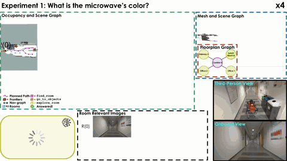
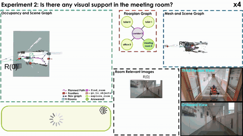

# <div align="center">HFLEX-EQA: Hierarchical Floorplan-Guided Vision-Language Exploration for Embodied Question Answering</div>

<div align="center">
  <a href="https://ntnu-arl.github.io/hflexeqa/"></a>
  <a href="https://arxiv.org/abs/2609.26360"></a>
  <a href="https://www.youtube.com/watch?v=fvqagiNmVcI"></a>
</div>

[](LICENSE)
[](https://docs.ros.org/en/jazzy/)

Hierarchical Floorplan-Guided Vision-Language Exploration (HFLEX-EQA) is an embodied question answering system for previously unseen indoor environments. It incrementally builds an open-vocabulary hierarchical 3D scene graph from RGB-D observations, stores task-relevant views, and gives a high-level VLM the scene graph, visual memory, exploration history, and an optional topological floorplan. The VLM can answer or select a specialized behavior: explore a known room, inspect an observed object, or search for a relevant unseen room.

The system was evaluated in Habitat on the OpenEQA and ExploreEQA question sets and deployed on an ANYmal quadruped with an Ouster OS0, VectorNav VN100, RealSense D455, and NVIDIA Jetson Thor. All perception and planning run onboard; configured VLM backends may use external APIs.

<table>
  <tr>
    <td width="50%" align="center">
      <a href="https://github.com/ntnu-arl/hflex_eqa/raw/refs/heads/main/assets/micro_speed_up_fhd_no_voice.mp4"></a>
      <br><a href="https://github.com/ntnu-arl/hflex_eqa/raw/refs/heads/main/assets/micro_speed_up_fhd_no_voice.mp4">Full-resolution MP4</a>
    </td>
    <td width="50%" align="center">
      <a href="https://github.com/ntnu-arl/hflex_eqa/raw/refs/heads/main/assets/screen_speed_up_fhd_no_voice.mp4"></a>
      <br><a href="https://github.com/ntnu-arl/hflex_eqa/raw/refs/heads/main/assets/screen_speed_up_fhd_no_voice.mp4">Full-resolution MP4</a>
    </td>
  </tr>
</table>

## Table of contents

- [Repository layout](#repository-layout)
- [Installation with Docker](#installation-with-docker)
- [Workspace models and offline operation](#workspace-models-and-offline-operation)
- [Download HM3D and EQA benchmarks](#download-hm3d-and-eqa-benchmarks)
- [Generate Habitat floorplans](#generate-habitat-floorplans)
- [Run one Habitat episode](#run-one-habitat-episode)
- [Run OpenEQA or ExploreEQA](#run-openeqa-or-exploreeqa)
- [Deploy on Jetson Thor and ANYmal](#deploy-on-jetson-thor-and-anymal)
- [Dependency branch matrix](#dependency-branch-matrix)
- [Citation](#citation) · [License](#license) · [Acknowledgements](#acknowledgements) · [Contact](#contact)

## Repository layout

- [`hflex_eqa/`](hflex_eqa/): C++ planning library and runtime configurations.
- [`hflex_eqa_python/`](hflex_eqa_python/): VLM planner and evaluation utilities.
- [`install/default.repos`](install/default.repos) and [`install/thor.repos`](install/thor.repos): desktop/Habitat and Jetson Thor dependency sets.
- [`docker/default/`](docker/default/) and [`docker/thor/`](docker/thor/): ROS 2 Jazzy images for a CUDA desktop and Jetson Thor.

ROS nodes, launch files, dataset orchestration, and robot integration live in the separate [`hflex_eqa_ros` repository](https://github.com/ntnu-arl/hflex_eqa_ros/tree/main).

## Installation with Docker

Requirements are Docker Engine, Docker Compose v2, the NVIDIA Container Toolkit, an NVIDIA GPU, Git, and `vcstool`. Create a workspace and import the dataset/simulation branches:

```bash
mkdir -p ~/hflex_eqa_ws/src
cd ~/hflex_eqa_ws/src
git clone https://github.com/ntnu-arl/hflex_eqa.git
cd ..
vcs import src < src/hflex_eqa/install/default.repos
git -C src/habitat-ros submodule update --init --recursive
mkdir -p results data/hm3d models hf_cache hf_models .clip
printf '%s\n' 'build: {cmake-args: [-DCMAKE_BUILD_TYPE=Release]}' > colcon_defaults.yaml
cd src/hflex_eqa/docker/default
cp .env.example .env                 # add the API keys you use
make build
make run
```

Inside the container, build and source the ROS overlay:

```bash
cd /developer/hflex_eqa_ws
colcon build --symlink-install --continue-on-error
source install/setup.bash
```

Both [desktop](docker/default/docker-compose.yaml) and [Thor](docker/thor/docker-compose.yaml) Compose profiles set `COLCON_DEFAULTS_FILE` to the workspace-root file created above, so all container builds use Release mode. The desktop profile mounts `HM3D_DATA` at `/developer/hm3d` (read-only) and `RESULTS_DIR` at `/developer/results`. If you override either host path on `make run` or `make dataset`, the workspace's `data/hm3d` and `results` directories do not change; inspect the `/developer/` mount paths instead.

## Workspace models and offline operation

Large weights and caches are intentionally outside `src/` and are mounted into the container with the workspace:

```text
~/hflex_eqa_ws/
├── colcon_defaults.yaml
├── yoloe-11l-seg.pt             # default detector
├── FastSAM-x.pt                  # optional FastSAM configuration
├── mobileclip_blt.ts             # optional; unused by the supplied launches
├── models/lseg.ckpt              # default pixelwise encoder
├── hf_models/                    # OpenCLIP ViT-B/32 cache
├── hf_cache/                     # Hugging Face/timm cache
├── .clip/ViT-B-32.pt             # OpenAI CLIP cache
├── data/hm3d/
├── results/
└── src/
```

`models/lseg.ckpt` must be staged before the first run; it is not downloaded by the code. Download the [official LSeg demo checkpoint](https://github.com/isl-org/lang-seg#-try-demo-now) and save it under that name. With internet access, the first launch can download `yoloe-11l-seg.pt` and populate `hf_models/`, `hf_cache/`, and `.clip/`; keep `HF_HUB_OFFLINE=0` and `TRANSFORMERS_OFFLINE=0` in the [desktop](docker/default/.env.example) or [Thor](docker/thor/.env.example) `.env` file for that run. Copy the resulting files to the same paths on an offline robot, then set both values to `1`. The default semantic model paths are in [`yoloe-openclip_vit32b.yaml`](https://github.com/ntnu-arl/semantic_inference_ros/blob/hflex_eqa/semantic_inference_ros/config/openset/yoloe-openclip_vit32b.yaml).

## Download HM3D and EQA benchmarks

Request access to [HM3D](https://aihabitat.org/datasets/hm3d/) and a Matterport API token, then follow the [Habitat-Sim dataset guide](https://github.com/facebookresearch/habitat-sim/blob/main/DATASETS.md#habitat-matterport-3d-research-dataset-hm3d). Download the v0.2 train and validation scenes **with semantic annotations**.

The real scene root will be `~/hflex_eqa_ws/data/versioned_data/hm3d-0.2/hm3d` on the host. Pass **that directory**, not its parent, as `HM3D_DATA`; it must contain `train/`, `val/`, and `hm3d_annotated_basis.scene_dataset_config.json`. For a different storage location, use its equivalent scene root.

From the host workspace root, fetch the public benchmark metadata into that scene root (change `HM3D_ROOT` if your scenes live elsewhere):

```bash
HM3D_ROOT="$PWD/data/versioned_data/hm3d-0.2/hm3d"
curl -fL https://raw.githubusercontent.com/facebookresearch/open-eqa/main/data/open-eqa-v0.json \
  -o "$HM3D_ROOT/open-eqa-v0.json"
curl -fL https://raw.githubusercontent.com/Stanford-ILIAD/explore-eqa/master/data/questions.csv \
  -o "$HM3D_ROOT/explore_eqa_questions.csv"
curl -fL https://raw.githubusercontent.com/Stanford-ILIAD/explore-eqa/master/data/scene_init_poses.csv \
  -o "$HM3D_ROOT/explore_eqa_scene_init_poses.csv"
curl -fL https://raw.githubusercontent.com/SaumyaSaxena/graph_eqa/main/cfg/openeqa_init_trajs.json \
  -o "$HM3D_ROOT/openeqa_init_trajs.json"
curl -fL https://raw.githubusercontent.com/SaumyaSaxena/graph_eqa/main/cfg/open-eqa-choices.json \
  -o "$HM3D_ROOT/open-eqa-choices.json"
```

These are the official [OpenEQA questions](https://github.com/facebookresearch/open-eqa/tree/main/data) and [ExploreEQA questions and initial poses](https://github.com/Stanford-ILIAD/explore-eqa/tree/master/data). OpenEQA evaluation additionally needs `openeqa_init_trajs.json` and `open-eqa-choices.json`, which can be downloaded from [GraphEQA](https://github.com/SaumyaSaxena/graph_eqa/tree/main/cfg).

The floorplan generators also need HM3DSem region votes. Habitat's scene downloader does not include the [statistics archive](https://github.com/matterport/habitat-matterport-3dresearch/blob/main/statistics/HM3DSem-v0.2.zip); from the host workspace root, extract its required CSV unless you already have it:

```bash
HM3D_VERSION="$PWD/data/versioned_data/hm3d-0.2"
mkdir -p "$HM3D_VERSION/statistics"
curl -fL https://raw.githubusercontent.com/matterport/habitat-matterport-3dresearch/main/statistics/HM3DSem-v0.2.zip \
  -o "$HM3D_VERSION/statistics/HM3DSem-v0.2.zip"
unzip -p "$HM3D_VERSION/statistics/HM3DSem-v0.2.zip" Per_Scene_Region_Weighted_Votes.csv \
  > "$HM3D_VERSION/statistics/Per_Scene_Region_Weighted_Votes.csv"
```

## Generate Habitat floorplans

The [OpenEQA](https://github.com/ntnu-arl/hflex_eqa_ros/blob/main/simulation_manager_ros/data/hm3d/generate_floorplans.py) and [ExploreEQA](https://github.com/ntnu-arl/hflex_eqa_ros/blob/main/simulation_manager_ros/data/hm3d/generate_floorplans_exploreeqa.py) generators sample the HM3D semantic meshes, label regions using the HM3DSem vote CSV, and build room connectivity graphs. Ensure the semantic `.glb`/`.txt` files, vote CSV, and initial-pose files downloaded above are present. `--llm_for_unlabeled_rooms` is optional and uses `OPENAI_API_KEY` when enabled.

Run this once in the desktop container opened with `make run`; use the writable workspace path, **not** `/developer/hm3d`, which Compose mounts read-only:

```bash
HM3D_VERSION=/developer/hflex_eqa_ws/data/versioned_data/hm3d-0.2
HM3D_ROOT="$HM3D_VERSION/hm3d"
VOTES="$HM3D_VERSION/statistics/Per_Scene_Region_Weighted_Votes.csv"
TOOLS=/developer/hflex_eqa_ws/src/hflex_eqa_ros/simulation_manager_ros/data/hm3d
FLOORPLAN_PY=/developer/hflex_eqa_ws/.venv-floorplans/bin/python
python3 -m venv --system-site-packages /developer/hflex_eqa_ws/.venv-floorplans
"$FLOORPLAN_PY" -m pip install 'open3d==0.19.0' trimesh pandas networkx openai

"$FLOORPLAN_PY" "$TOOLS/generate_floorplans.py" \
  --hm3d_dir "$HM3D_ROOT" --region_votes_path "$VOTES" \
  --init_poses_path "$HM3D_ROOT/openeqa_init_trajs.json" \
  --extract_topological_graph
"$FLOORPLAN_PY" "$TOOLS/generate_floorplans_exploreeqa.py" \
  --hm3d_dir "$HM3D_ROOT" --region_votes_path "$VOTES" \
  --init_poses_path "$HM3D_ROOT/explore_eqa_scene_init_poses.csv" \
  --extract_topological_graph
```

OpenEQA processes `val/`; ExploreEQA processes `train/` and `val/`. Their outputs are `<scene>/regions/topological_graph.json` and `<scene>/explore_eqa_regions_<floor>/topological_graph.json`, respectively, matching the [episode loader](https://github.com/ntnu-arl/hflex_eqa_ros/blob/main/simulation_manager_ros/simulation_manager_ros/data.py). The generators also save occupancy maps and visualization images.

If HM3D is outside the workspace, the regular `/developer/hm3d` mount is read-only. From `docker/default/` on the host, start a preprocessing shell with its version directory additionally mounted writable (replace the example path), then set `HM3D_VERSION=/developer/hm3d-version` in the commands above. Leave the normal evaluation mount read-only.

```bash
HFLEX_WS="$HOME/hflex_eqa_ws"
HM3D_VERSION_HOST=/absolute/path/to/hm3d-0.2
HM3D_DATA="$HM3D_VERSION_HOST/hm3d"
RESULTS_DIR="$HFLEX_WS/results"
export HFLEX_WS HM3D_DATA RESULTS_DIR
docker compose -f docker-compose.yaml run --rm \
  -v "$HM3D_VERSION_HOST:/developer/hm3d-version:rw" ros2_hflex_eqa
```

## Run one Habitat episode

From `src/hflex_eqa/docker/default/` on the host, start the desktop container with the HM3D scene root mounted at `/developer/hm3d`:

```bash
make run HM3D_DATA="$HOME/hflex_eqa_ws/data/versioned_data/hm3d-0.2/hm3d"
```

Then launch an episode inside the container:

```bash
SCENE_DIR=/developer/hm3d/val/00808-y9hTuugGdiq
ros2 launch hflex_eqa_ros habitat_eqa.launch.yaml \
  scene_file:="$SCENE_DIR/y9hTuugGdiq.basis.glb" \
  question:="What color is the bed frame"
```

On an 8 GB GPU, set `HFLEX_EQA_QUERY_DEVICE=cpu` before the launch command to move the text-query CLIP models to CPU. YOLOE and LSeg still run on the GPU, and the VLM backend is unchanged:

```bash
HFLEX_EQA_QUERY_DEVICE=cpu ros2 launch hflex_eqa_ros habitat_eqa.launch.yaml \
  scene_file:="$SCENE_DIR/y9hTuugGdiq.basis.glb" \
  question:="What color is the bed frame"
```

No floorplan is loaded by default: the nested high-level launch uses an empty node/edge list and no JSON path. `use_floorplan_prior` defaults to `true`, but the planner only adds the prior when the graph contains nodes. To load a graph generated in the [floorplan step](#generate-habitat-floorplans), pass its **container path** through the single-scene launch:

```bash
SCENE_DIR=/developer/hm3d/val/00808-y9hTuugGdiq
ros2 launch hflex_eqa_ros habitat_eqa.launch.yaml \
  scene_file:="$SCENE_DIR/y9hTuugGdiq.basis.glb" \
  floorplan_source:=json \
  floorplan_json_path:="$SCENE_DIR/regions/topological_graph.json" \
  use_floorplan_prior:=true \
  question:="What color is the bed frame"
```

Replace the example scene with one whose graph exists. For ExploreEQA, use `explore_eqa_regions_<floor>/topological_graph.json` instead of `regions/topological_graph.json`. The [top-level launch](https://github.com/ntnu-arl/hflex_eqa_ros/blob/main/hflex_eqa_ros/launch/habitat/habitat_eqa.launch.yaml) forwards these arguments to the [high-level launch](https://github.com/ntnu-arl/hflex_eqa_ros/blob/main/hflex_eqa_ros/launch/habitat/habitat_high_level.launch.yaml); changing only the floorplan fields in `high_level.yaml` is insufficient because launch arguments override them.

The main launch is [`habitat_eqa.launch.yaml`](https://github.com/ntnu-arl/hflex_eqa_ros/blob/main/hflex_eqa_ros/launch/habitat/habitat_eqa.launch.yaml). Edit the local [`high_level.yaml`](hflex_eqa/config/habitat/high_level.yaml) to select OpenAI, Gemini, Llama, Anthropic, or an OpenAI-compatible local vLLM backend; [`habitat.yaml`](hflex_eqa/config/habitat/habitat.yaml) holds the C++ planner settings, and the [Habitat prompt files](hflex_eqa/config/habitat/) hold VLM instructions. The current launch interpolates `question` into unquoted YAML, so avoid punctuation such as `?` in this override.

Single-scene launches start each EQA iteration automatically and send HFLEX-EQA's planned path to Habitat. Dataset launches use the simulation manager's episode trigger by default.

## Run OpenEQA or ExploreEQA

Place benchmark metadata alongside HM3D as configured in [`habitat_open_eqa.yaml`](https://github.com/ntnu-arl/hflex_eqa_ros/blob/main/simulation_manager_ros/config/habitat_open_eqa.yaml). Its default dataset is `exploreeqa`. Copy the config to the workspace root, set `data.dataset` to `openeqa` or `exploreeqa`, and review the question, pose, split, and output paths. From the host, start a container with both the scene root and results directory mounted:

```bash
cd ~/hflex_eqa_ws
cp src/hflex_eqa_ros/simulation_manager_ros/config/habitat_open_eqa.yaml experiment.yaml
${EDITOR:-nano} experiment.yaml  # select dataset and review paths
cd src/hflex_eqa/docker/default
make run HM3D_DATA=/path/to/hm3d RESULTS_DIR=/path/to/hflex_results
# Inside the container:
source /developer/hflex_eqa_ws/install/setup.bash
ros2 launch simulation_manager_ros simulate.launch.yaml \
  simulation_manager_config:=/developer/hflex_eqa_ws/experiment.yaml
```

This runs [`simulate.launch.yaml`](https://github.com/ntnu-arl/hflex_eqa_ros/blob/main/simulation_manager_ros/launch/simulate.launch.yaml) with the copied config. `make dataset` starts the same launch with its packaged default config. If `use_floorplan_prior` is enabled, [generate the floorplans](#generate-habitat-floorplans) first or disable the prior in your experiment config. The [test-split generator](https://github.com/ntnu-arl/hflex_eqa_ros/blob/main/simulation_manager_ros/data/hm3d/create_eqa_test_splits.py) is only needed when using a saved split manifest.

For an 8 GB GPU, pass `HFLEX_EQA_QUERY_DEVICE=cpu` to `make dataset` to run the text-query CLIP models on CPU:

```bash
make dataset HM3D_DATA=/path/to/hm3d HFLEX_EQA_QUERY_DEVICE=cpu
```

## Deploy on Jetson Thor and ANYmal

On the robot computer, import [`install/thor.repos`](install/thor.repos) and optionally [`install/thor_sensors_slam.repos`](install/thor_sensors_slam.repos) which contains the sensors and SLAM ros packages, copy [`docker/thor/.env.example`](docker/thor/.env.example) to `.env`, then run `make build` and `make run` from [`docker/thor/`](docker/thor/). Build the ROS packages in the container using the same `colcon` command above. The robot must provide the camera topics and `world -> body -> camera_link` transforms expected by [`scene_graph.launch.yaml`](https://github.com/ntnu-arl/hflex_eqa_ros/blob/main/hflex_eqa_ros/launch/scene_graph.launch.yaml); adapt remappings for another payload.

Start the complete stack with `make launch`, or use separate terminals:

```bash
ros2 launch hflex_eqa_ros scene_graph.launch.yaml
ros2 launch hflex_eqa_ros eqa.launch.yaml \
  floorplan_json_path:=/path/to/building_floorplan.json
```

The reusable [`eqa.launch.yaml`](https://github.com/ntnu-arl/hflex_eqa_ros/blob/main/hflex_eqa_ros/launch/eqa.launch.yaml), scene-graph launch, and [example paper floorplan](https://github.com/ntnu-arl/hflex_eqa_ros/blob/main/hflex_eqa_ros/config/anymal/eqa_floorplan.json) live in `hflex_eqa_ros`. Robot planner settings are in the local [`config/anymal/`](hflex_eqa/config/anymal/); [ROS topic settings](https://github.com/ntnu-arl/hflex_eqa_ros/tree/main/hflex_eqa_ros/config/anymal/) and the floorplan are in `hflex_eqa_ros`; Hydra's robot map settings are in [`reasoning_hydra/config/datasets/anymal.yaml`](https://github.com/ntnu-arl/reasoning_hydra/blob/hflex_eqa/config/datasets/anymal.yaml).

## Dependency branch matrix

Most NTNU-ARL dependencies use the unified `hflex_eqa` branch for both workflows (dataset and robot with a Jetson Thor). Two mapping dependencies remain platform-specific because our Thor build uses a custom GTSAM stack:

| Repository | Dataset/simulation | Robot deployment |
| --- | --- | --- |
| `kimera_pgmo` | `hflex_eqa/default` | `hflex_eqa/thor` |
| `kimera_rpgo` | `develop` | `thor` |

The supplied [desktop](install/default.repos) and [Thor](install/thor.repos) `.repos` files select these branches. `semantic_inference` and `vlms_ros` contain the small portability changes needed by both desktop and Thor, so users do not switch those repositories.

## Citation

If you use this project, please cite:
```bibtex
@article{puigjaner2026hflex-eqa,
    title={Hierarchical Floorplan-Guided Vision-Language Exploration for Embodied Question Answering},
    author={Gassol Puigjaner, Albert and Alexis, Kostas},
    journal={arXiv},
    year={2026}
}
```

## License

Released under the [BSD 3-Clause License](LICENSE). Dependencies and datasets retain their own licenses and terms.

## Acknowledgements

This open-source release is based on work supported by the **European Commission** through:

- **Project SYNERGISE**, under **Horizon Europe Grant Agreement No. 101121321**
- **Research Council of Norway**, under **Grant NCEI (No. 357451)**

## Contact

For questions or support, reach out via [GitHub Issues](https://github.com/ntnu-arl/hflex_eqa/issues) or contact the authors directly:

- [Albert Gassol Puigjaner](mailto:albert.g.puigjaner@ntnu.no)
- [Kostas Alexis](mailto:konstantinos.alexis@ntnu.no)

This research software is tested on Ubuntu 24.04/ROS 2 Jazzy and NVIDIA GPUs; other platforms are not currently supported.
